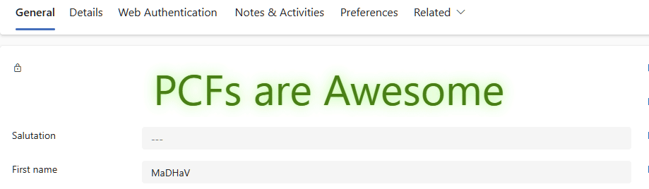

# HTMLMessage
## WHY
> I felt a need for a unbound, readonly, configurable extensive label, so I created this.
> I felt gap for a control that simply shows link from a related table, so I created this.

## WHAT
A simple yet very flexible PCF control to display text with custom style using HTML tags or CSS styles on a Unified Interface Form in Model Driven Apps on Common Data Service (CDS) / Dynamics 365 / Power Platforms.
The control could also be used for displaying lengthy text such as questions / instructions / information that cannot be displayed using out of the box label control. Text could be displayed with custom formats using HTML tags / CSS styles.
* **What it is** : Intended use is as a label/hyperlink and fancy HTML/CSS/SVG renderer
* **What it is NOT**: An input/modifier/manipulator control

### Inspiration
There are existing controls; search #text in [PCF Gallery](https://pcf.gallery/categories#text), there are tens of them!

This PCF is absolutely inspired by following other controls:
- [Simple Text Control](https://pcf.gallery/simple-text-control/) but with unlimited lines (or, rather, unlimited potential!)
- [Sliding Text](https://pcf.gallery/sliding-text/) with marquee tag
- [PowerDyn Custom Label PCF](https://pcf.gallery/powerdyn-custom-label-pcf/)
- [Custom Label](https://pcf.gallery/custom-label/)
- [Drop Shadow](https://pcf.gallery/dropshadow-text/)
- [Gradient Text](https://pcf.gallery/gradient-text/)

## HOW
Most text here is "highly inspired" from [GitHub Entry of Simple Text Control](https://github.com/Kokulan365/Simple-Text-Control-PCF)

The control allows customiser to add longer text than out of the box label control or section label.
A maximum of 1,048,576 text characters in total can be added as HTML message. The number includes any HTML tags added to the text.

💡 PCF configuration page only allows 160 characters  but the actual editor in [Maker Portal](https:///make.preview.powerapps.com) allows more. The text is rendered using a div container. 
And the message HTML itself is set using innerHTML property of the div element, making it easy to add html tags with the text to format or set the style.

### What is different about this control
|Character|Other Controls|This Control|
| ----- | ----- | ----- |
|1. **Unbound**|Render the current value of the data field|hows a message of choice as configured, not bound to any control value|
|2. **Strictly Read-only**|Allow manipulating underlying value|Display extensive labels, explanations, instructions, no input required/intended|
|3. **Configurable**|--|Configure any valid HTML (subject to your own imagination and experimentation as per the needs!). Prefix "HTML5 Pure CSS3" to your Google keyword and go wild!|

## WHAT

### DO/Works

- Basic HTML tags
- Uses default parent form styling (colour, font etc) so if we do not specify style, the inserted message gels well and looks like out of the box.

### DON'T/Does not work or never tested

- Bootstrap and other frameworks
- Styling HTML/BODY elements may break the whole form style

## HOW

### Embed and Configure
* Embed like you'd [use a PCF control](https://carldesouza.com/how-to-install-powerapps-components-from-pcf-gallery-to-your-org/).
* More details on [How to run the sample components?](https://github.com/microsoft/PowerApps-Samples/blob/master/component-framework/README.md)

1. The control currently only binds to a "Date Only" or "Date Time" type column, and the control can be added to the form by going into Controls tab of the field property and clicking on Add Control button.
    - Do not include HEAD
    - Only include **contents of** BODY tag
2. Ensure, once you added the control, you set the **HTML message**. Study the Code Samples given below to understand scope.

## Examples

|Use Case|Inspiration|Screenshot|Code|
| ----------- |----------- |----------- |----------- |
|1. **Business Legal**: A proper simple business notification or warning that needs to be displayed constantly, and has no relationship with the field value|---||[Code](samples/business.legal.htm)|
|2. **Shaking Text**With minimal code and no external library e.g. react|[React Shaking Text Virtual Component](https://pcf.gallery/react-shaking-text-virtual-component/)||[Code](samples/shaking.text.htm)|
|3. **Various HTML tags**:A capability Expo|[Sliding Text](https://pcf.gallery/sliding-text/) with marquee tag||[Code](samples/mixed.html.htm)|
|4. **Spinning Text**:Just that!|[Spinning Text](https://pcf.gallery/spinning-text/)||[Code](samples/svg.spinning.text.htm)|
|5. **Neon Flashing/Pulsating Glowing Text**:Just that!|[Glowing Text](https://pcf.gallery/glowing-text-control/) and [Pulsing Text](https://pcf.gallery/pulsing-text/)||[Code](samples/neon.flash.htm)|
|6. **Iframe**:Any third party webpage|A countdown to a FIXED date (not a field value)||[Code](samples/embedded.iframe.htm)|
|7. **Latest Related Contact**:Show a hyperlink|Link to latest (MODIFIEDON DESCENDING) contact record [Sample OData URL](https://YourOrg.crm6.dynamics.com/api/data/v9.2/contacts?$select=fullname&$filter=_parentcustomerid_value%20eq%20{ID}&$orderby=modifiedon%20desc&$top=1). 💡 {ID} is replaced by current record's ID, read [How to get EntityId ](https://learn.microsoft.com/en-us/power-apps/developer/component-framework/faq#how-can-i-access-the-record-id-or-table-name).||--|

## WHEN
I have no committment or idea, when I can release more updates to this but if you really find another use case or PCF Gallery control scenario that can be addressed, pleasse get in touch.

☕ Feel free to [Buy me a coffee!](https://buymeacoffee.com/sarjanwebdb)
